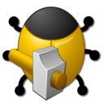
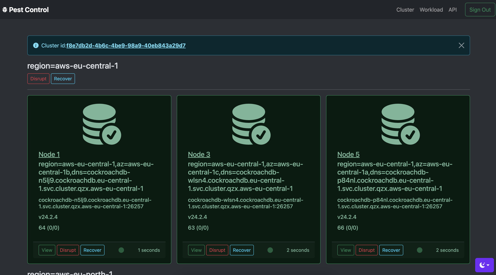
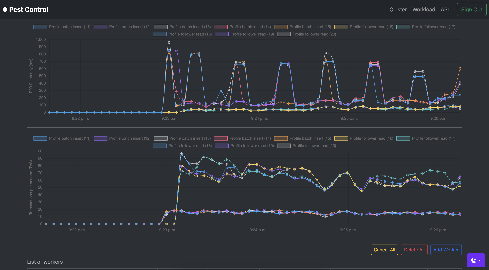

<p>	
	<a href="https://github.com/cloudneutral/pestcontrol/actions/workflows/maven.yml">
</p>

<!-- TOC -->
* [About](#about)
  * [Main features](#main-features)
  * [Compatibility](#compatibility)
  * [How it works](#how-it-works)
* [Terms of Use](#terms-of-use)
* [Prerequisites](#prerequisites)
  * [Install the JDK](#install-the-jdk)
  * [Install Toxiproxy (optional)](#install-toxiproxy-optional)
* [Building](#building)
  * [Clone the project](#clone-the-project)
  * [Build the artifacts](#build-the-artifacts)
* [Installing](#installing)
* [Configuration](#configuration)
  * [Application](#application)
  * [Clusters](#clusters)
  * [DataSource Properties](#datasource-properties)
* [Running](#running)
* [Local Cluster Management](#local-cluster-management)
  * [Local Cluster Configuration](#local-cluster-configuration)
    * [Enable Toxiproxy (optional)](#enable-toxiproxy-optional)
  * [Start cluster](#start-cluster)
    * [Insecure Mode (default)](#insecure-mode-default)
    * [Secure Mode](#secure-mode)
  * [Next Steps](#next-steps)
  * [Remarks](#remarks)
  * [Shutdown](#shutdown)
* [Appendix: Configuration Files](#appendix-configuration-files)
<!-- TOC -->

# About

 

[Pest Control](https://github.com/cloudneutral/pestcontrol) is a combined graphical and command-line tool for 
controlling and visualizing CockroachDB cluster failures, and it's 
impact on application workloads. It supports CockroachDB Cloud 
and local, self-hosted clusters for which it provides easy-to-use 
bash scripts.

## Main features

The main features include:

- Visualize cluster layout and node health. 
- Provide node disruption and recovery controls.
- Integrate with [Toxiproxy](https://github.com/Shopify/toxiproxy) for chaos testing.
- Tigger client workloads and visualize impact during steady state and node / zone / region disruptions.
- Provide easy-to-use bash scripts for local CockroachDB cluster deployment and management.

Dashboard showing cluster layout and node status:



Workload page with some activity:



## Compatibility

This tool supports the following platforms and versions:

- CockroachDB Cloud v22.2+
  - Requires a feature flag enabled for the organization (file a support request) 
- CockroachDB Local Self-Hosted v22.2+
  - Secure or insecure mode
  - No license key needed
- MacOS (main platform)
- Linux

## How it works

Pest Control consists of two parts:

- A web app for the visuals, with a REST API for automation. 
- Bash scripts for simple installation and management of local CockroachDB clusters.

The web app adapts to the logged in cluster type that can be either CockroachDB Cloud 
or a self-hosted cluster.

The bash scripts are used for local deployments only and manage local cluster 
nodes, haproxy, toxiproxy and launching the web app.

Overall it uses the Cockroach Cloud API, Cluster API, bash scripts, 
JDBC for the built-in workloads and HTTP to interact with Toxiproxy. 

# Terms of Use

This tool is not supported by Cockroach Labs. Use of this tool is entirely at your
own risk and Cockroach Labs makes no guarantees or warranties about its operation.

See [MIT](LICENSE.txt) for terms and conditions.

# Prerequisites

Things you need to run Pest Control locally.

- Java 17+ JDK
  - https://openjdk.org/projects/jdk/17/
  - https://www.oracle.com/java/technologies/downloads/#java17
- Toxiproxy (optional)
  - https://github.com/Shopify/toxiproxy
  
## Install the JDK

MacOS (using sdkman):

    curl -s "https://get.sdkman.io" | bash
    sdk list java
    sdk install java 17.0 (pick version)  

Ubuntu:

    sudo apt-get install openjdk-17-jdk

## Install Toxiproxy (optional)

Toxiproxy provides the fundamentals for chaos testing but is not mandatory
to use with Pestcontrol.

See [Installing Toxiproxy](https://github.com/Shopify/toxiproxy?tab=readme-ov-file#1-installing-toxiproxy).

# Building

Instructions for building the project locally, as an alternative to using the
packaged TAR.GZ assembly artifact.

## Clone the project

    git clone git@github.com:cloudneutral/pestcontrol.git && cd pestcontrol

## Build the artifacts

    chmod +x mvnw
    ./mvnw clean install

# Installing

If you prefer to use a packaged artifact (release or snapshot) rather than building, 
see [GitHub Packages](https://github.com/orgs/cloudneutral/packages?repo_name=pestcontrol). Scroll to the latest `TAR.GZ` file and copy+paste the download URL
as described:

    curl -o pestcontrol.tar.gz <paste-url-here>
    tar xvf pestcontrol.tar.gz && cd pestcontrol

# Configuration

Pest Control is configured through the files available in the [config](config) directory.
The main configuration properties are in the [config/application-default.yml](config/application-default.yml) file.

You can either edit that file directly or create a new one with a custom name
suffix and then pass that name in the `--profiles` argument.

    cp config/application.yml config/application-craig.yml
    java -jar pestcontrol.jar --profiles craig

Example configuration with 3 cloud clusters and 2 local clusters:

```yaml
application:
  clusters:
    - cluster-id: "97a73235-fa45-4b4d-a229-f5efd52168ba"
      cluster-type: cloud_dedicated
      api-key: "..."
      admin-url: "https://admin-odin-qzx.cockroachlabs.cloud:8080"
      data-source-properties:
        url: "jdbc:postgresql://odin-qzx.aws-eu-north-1.cockroachlabs.cloud:26257/defaultdb?sslmode=require"
        username: "craig"
        password: "cockroach"
   
    - cluster-id: "bdeb3c96-4ab4-458a-86ac-927efd844294"
      cluster-type: cloud_dedicated
      api-key: "..."
      admin-url: "https://admin-hugin-qzx.cockroachlabs.cloud:8080"
      data-source-properties:
        url: "jdbc:postgresql://hugin-qzx.aws-eu-north-1.cockroachlabs.cloud:26257/defaultdb?sslmode=require"
        username: "craig"
        password: "cockroach"
   
    - cluster-id: "e3e17085-bbda-4d13-85a4-49e81dab04b0"
      cluster-type: cloud_dedicated
      api-key: "..."
      admin-url: "https://admin-munin-qzx.cockroachlabs.cloud:8080"
      data-source-properties:
        url: "jdbc:postgresql://munin-qzx.aws-eu-north-1.cockroachlabs.cloud:26257/defaultdb?sslmode=require"
        username: "craig"
        password: "cockroach"

    - cluster-id: "Local Secure Cluster"
      cluster-type: local_secure
      admin-url: "https://localhost:443"
      data-source-properties:
        url: "jdbc:postgresql://localhost:26257/defaultdb?sslmode=require"
        username: "craig"
        password: "cockroach"
      
    - cluster-id: "Local Insecure Cluster"
      cluster-type: local_insecure
      admin-url: "http://localhost:8080"
      data-source-properties:
        url: "jdbc:postgresql://localhost:26257/defaultdb?sslmode=disable"
        username: "craig"
        password: "cockroach"
```

## Application

Top-level entry in `application<-profile>.yml`.

```yaml
    application:
      clusters:
        ...
 ```

| Field Name  | Optional | Default | Description                         |
|-------------|----------|---------|-------------------------------------|
| clusters    | No       | -       | Collection of CockroachDB clusters. |

## Clusters

Collection of cluster definitions.

```yaml
    application:
      clusters:
        - cluster-id: "38e2ce4f-e9b6-43ae-a9ed-64d673e443cb"
          cluster-type: cloud_dedicated
          api-key: "..."
          admin-url: "https://admin-odin-qzx.cockroachlabs.cloud:8080"
          data-source-properties:
            ...
```

| Field Name             | Optional | Default         | Description                                                                                                                                    |
|------------------------|----------|-----------------|------------------------------------------------------------------------------------------------------------------------------------------------|
| cluster-id             | No       | -               | Either a CockroachDB Cloud cluster ID or a unique string for a local cluster                                                                   |
| cluster-type           | Yes      | cloud_dedicated | `cloud_dedicated`, `local_secure` or `local_insecure`                                                                                          |
| api-key                | Yes      | -               | Only required for `cloud_dedicated`, see [Create API Keys](https://www.cockroachlabs.com/docs/cockroachcloud/managing-access#create-api-keys). |
| admin-url              | No       | -               | Base URL for the Cluster API which is typically the regional/local cluster load balancer endpoint.                                             |
| data-source-properties | No       | -               | Data source connection parameters.                                                                                                             |

## DataSource Properties

The JDBC datasource configuration for querying node status and running workloads.

```yaml
    application:
      clusters:
          data-source-properties:
            url: "jdbc:postgresql://localhost:26257/defaultdb?sslmode=require"
            username: "craig"
            password: "cockroach"
```

| Field Name | Optional | Default   | Description                                |
|------------|----------|-----------|--------------------------------------------|
| url        | No       | -         | The JDBC connection URL.                   |
| username   | No       | craig     | The SQL user with ADMIN role.              |
| password   | Yes      | cockroach | The SQL user password for secure clusters. |


# Running

Start the app in the background:
    
    ./cluster-admin start-service

Now you can access the application via http://localhost:9090 and login to the cluster 
of choice.

**Alternative**

Start the app in the foreground:
    
    ./cluster-admin run-service <args>

Equivalent to:

    ln -sf target/pestcontrol-<version>.jar pestcontrol.jar
    java -jar pestcontrol.jar <args>

# Local Cluster Management

This section apply only if you intend to install and operate a local, secure or 
insecure cluster, optionally with toxiproxy for chaos testing. 

## Local Cluster Configuration

The default settings are usually sufficient unless you have conflicting network ports occupied.

CockroachDB can operate in either insecure or secure mode. The default security mode 
is `insecure`. 

- Edit the `config/settings.cfg` file to change `security_mode` to either `secure|insecure`.   

- Edit `config/settings-secure.cfg` or `config/settings-insecure.cfg` and change host, 
port or other details, if necessary.

### Enable Toxiproxy (optional)

- Edit the `config/settings.cfg` file to change `toxiproxy="on"`. 

This will make CockroachDB use a different `advertise-host` port, allowing the 
proxies to be injected and intercept the RPC traffic using different toxics. 

Think of it like valves or filters put on a pipe to regulate water flow.

## Start cluster

### Insecure Mode (default)

    ./cluster-admin install  
    ./cluster-admin start-toxi (if enabled)
    ./cluster-admin start-all (pick 1,2,3 to begin with)
    ./cluster-admin start-lb
    ./cluster-admin init
    ./cluster-admin open

### Secure Mode

First edit the `config/application.yml` file and uncomment the `spring.ssl` section.

    ./cluster-admin install  
    ./cluster-admin certs
    ./cluster-admin start-toxi (if enabled)
    ./cluster-admin start-all (pick 1,2,3 to begin with)
    ./cluster-admin start-lb
    ./cluster-admin init
    ./cluster-admin open

The secure mode will use self-signed CA certificates and keys in `.certs` including the
PKCS12 truststore used by the web app.

## Next Steps

Once the cluster is up, you can either use the [Web UI](http://localhost:9090) (recommended) 
or `cluster-admin` to kill and start nodes.

## Remarks

If you switch between the `secure` and `insecure` modes, re-run the `init` command to
set proper SQL user roles and secrets.

## Shutdown

To shut things down, run the inverse:

    ./cluster-admin stop-service
    ./cluster-admin stop-lb
    ./cluster-admin stop-all
    ./cluster-admin stop-toxi
    ./cluster-admin clean

# Appendix: Configuration Files

Pest Control can be configured through the files available in the `config` directory:

1. [settings.sh](config/settings.cfg) - Settings for creating and managing a local CockroachDB cluster.
1. [settings-insecure.sh](config/settings-insecure.cfg) - Settings for using a local CockroachDB self-hosted cluster in insecure mode.
1. [settings-secure.sh](config/settings-secure.cfg) - Settings for using a local CockroachDB self-hosted cluster in secure mode.
1. [init.sql](config/init.sql) - Init SQL statements (optional).
1. [haproxy.cfg](config/haproxy.cfg) - HAProxy configuration for local CockroachDB cluster.
1. [application-default.yml](config/application-default.yml) - Cluster connection settings.

---

That is all, carry on!
